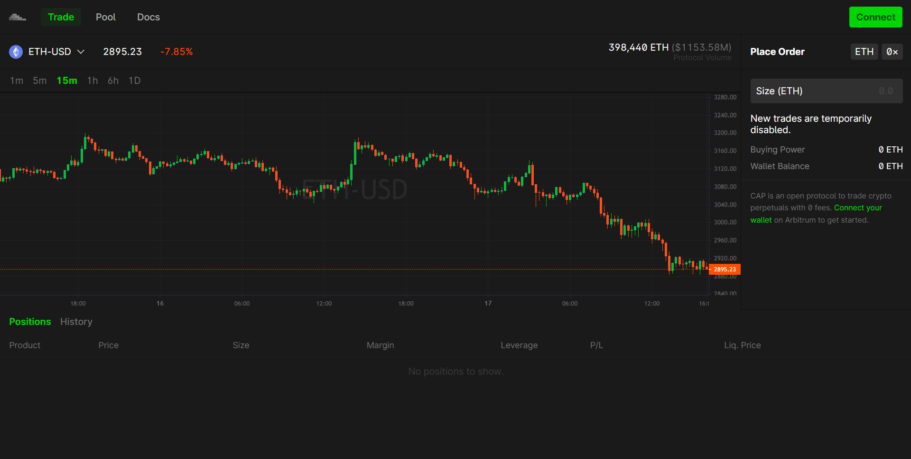
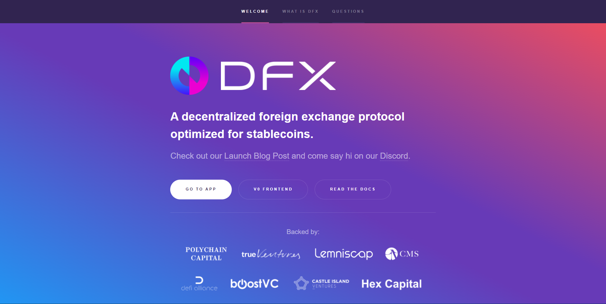
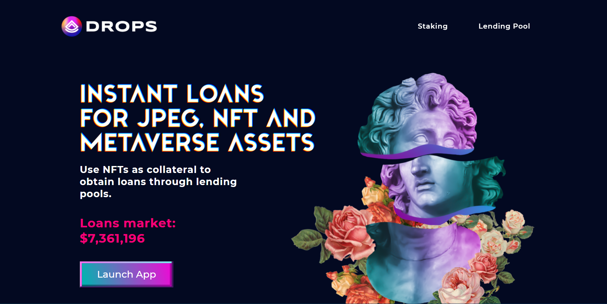
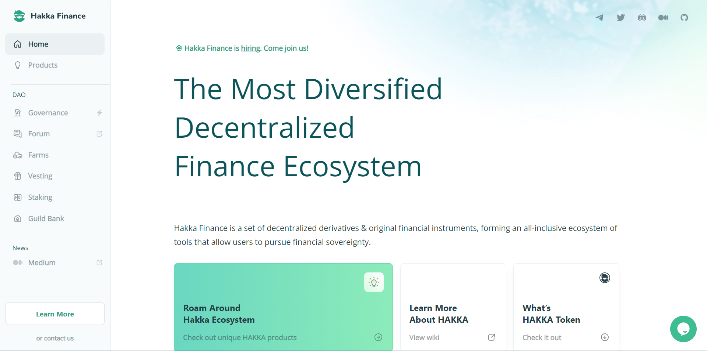
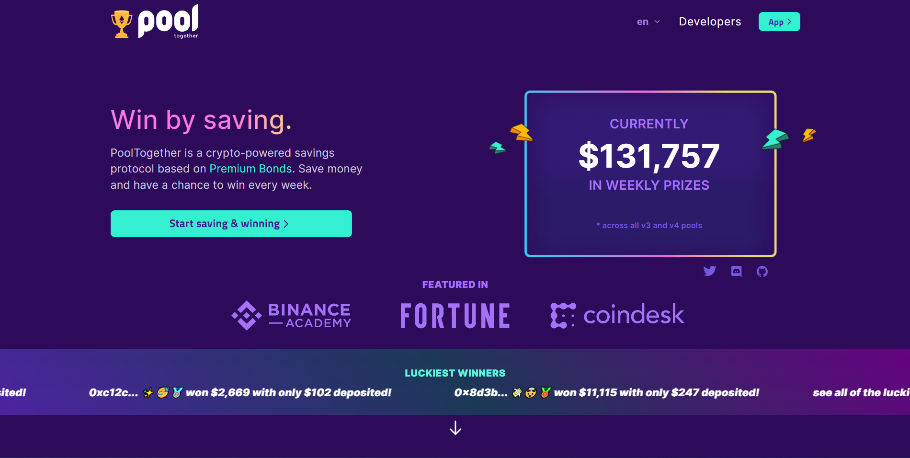
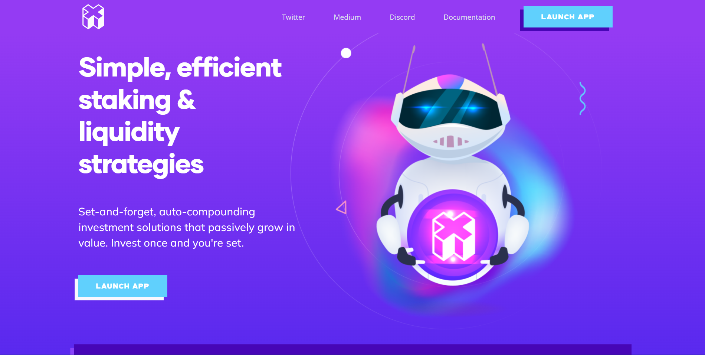

<h1 align="center">Fancy seeing you here!</h1>

<h1 align="center">👍 Summary</h1>

                                                       

- Passionate, talent and humble Full Stack Devlooper
- Strong knowledge in blockchain technologies
- Constantly learning new concepts and technologies
- Always striving to make process more efficient
- Can’t wait to create a new creative something
- Keep pushing forward to the end of the world
- Day after day, year after year, developing...

<h1 align="center">⚡ Skills</h1>

## 👨‍⚖️ Language

## ⛓ Blockchain

## 🛒 Backend

## 🎆 Frontend

## 🧵 Database

## 🔮 Hosting Service

## 🔌 Version Control Management

<h1 align="center">🏆 Last Projects</h1>

<h2 align="center">Defi</h2>

    
		&nbsp;&nbsp;&nbsp;
    
		&nbsp;&nbsp;&nbsp;
		

    
		&nbsp;&nbsp;&nbsp;
    
		&nbsp;&nbsp;&nbsp;
		

